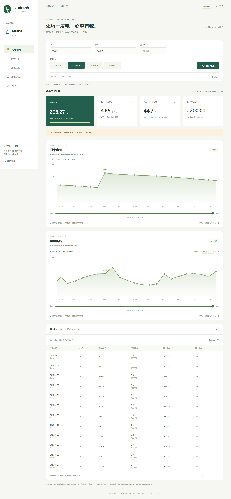
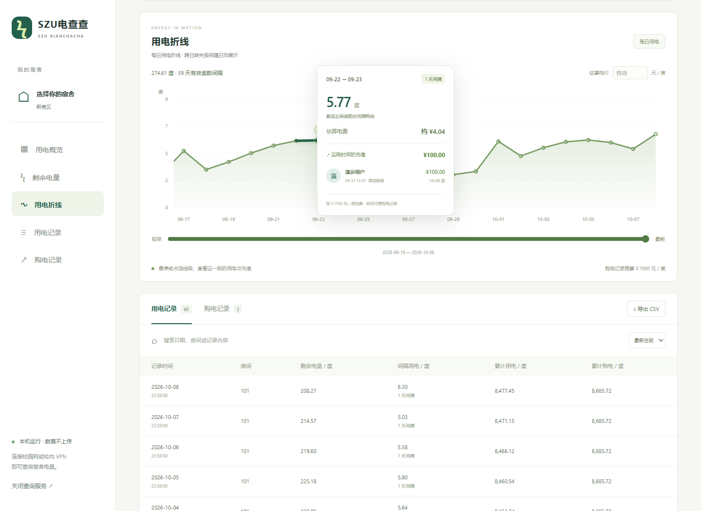

# SZU电查查

深大宿舍电量查询与可视化工具。免安装、本机运行，用浏览器看剩余电量、用电趋势和购电明细。

[下载 Windows 免安装版](https://github.com/yuyiwei01/szu-dianchacha/releases/latest) · [使用说明](docs/usage.md) · [开发与测试](docs/development.md)



> 截图使用模拟数据。查询真实记录需要连接能够访问校园 SIMS 电控系统的校园网或校内 VPN。

## 功能

- 记住默认宿舍，每次打开自动查询近 30 天；首次使用先选择自己的宿舍。
- 近 7 天、30 天、60 天、近一年快捷查询，详细日期放在高级筛选中。
- 剩余电量和用电折线独立展示；长时间范围用滑块浏览。
- 悬停或点选线段，查看区间耗电、估算费用和充值明细。
- 支持记录搜索、购买形式筛选、时间排序和 CSV 导出。
- 按页读取并核对总条数，避免部分记录被误当成完整查询结果。
- 保留上次查询缓存；无需联网也可以体验演示界面。



## 使用

1. 在 [Releases](https://github.com/yuyiwei01/szu-dianchacha/releases/latest) 下载 `SZU-Dianchacha.exe`（SZU电查查）。
2. 双击打开，首次填写校区、楼栋和房间号。
3. 连接校园网或校内 VPN，点击查询；后续打开自动查询。

支持 Windows 10 / 11，使用系统自带的 PowerShell 和 .NET Framework，以及默认浏览器。无需安装 Python 或 Node.js。

也可以下载源码、完整解压后，双击根目录的 `启动SZU电查查.bat`。关闭浏览器不会关闭本机服务，完全退出请点击页面中的“关闭查询服务”。

## 本机数据

本机服务只监听 `127.0.0.1`。界面资源随程序提供，查询直接由本机访问校园系统，没有云端中转。

宿舍偏好在 `%LOCALAPPDATA%\SzuElectricity\preferences.json` 保存，重启、换浏览器、变更本地端口和更新 exe 后仍有效。查询明细缓存保存在当前浏览器，可以在页面中清除。

剩余电量来自日末记录，页面注明数据日期。费用按付费购电记录推算单价，也可手动填写；估算不代表学校账单。

## 项目结构

```text
web/                 界面、图表、筛选与导出
server.ps1           本机网页服务、查询任务与宿舍偏好
query.ps1            校区与楼栋配置
query-functions.ps1  查询、解析与完整分页检查
launch.ps1           源码版启动器
packaging/           单文件 exe 启动器和构建脚本
tests/               模拟数据测试与可选校内测试
docs/                使用、开发说明和演示截图
dist/                本地构建输出，不提交到源码仓库
```

## 开发与贡献

无需前端构建工具。运行 `node --test tests/model.test.mjs` 和 `powershell -File tests/query.test.ps1` 可执行不依赖校园网的核心测试。运行 `powershell -File packaging/build.ps1` 生成 exe 和源码版压缩包。

浏览器验证、校园网集成测试和构建细节见 [开发说明](docs/development.md)。欢迎提交问题和改进；反馈截图请遮住宿舍、购买者和购买记录。

项目为独立开发工具，与学校官方应用无隶属关系。仅查询，不提供充值功能。

## 许可证

[MIT](LICENSE)
